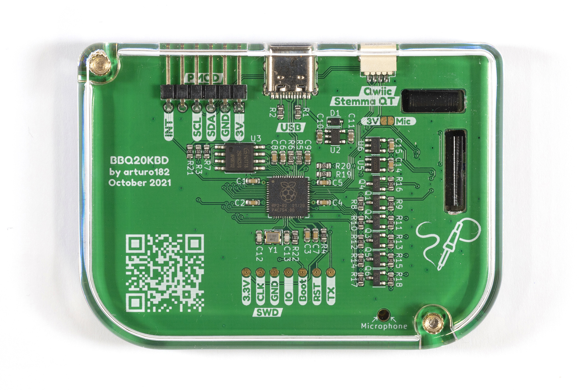

# BBQ20KBD

A BB Q20 Keyboard in USB/PMOD/Qwiic format!

This is the evolution of our previous BBQ10 PMOD board. We took all the feedback from that board and improved on the design in every way.

We added a **Qwiic/Stemma QT** connector, we added **USB HID support**, we changed to a Q20 keyboard, which gave us four extra buttons, and the **optical trackpad** that works as a **USB HID Mouse**.

The board uses the Raspberry Pi RP2040 MCU to poll the keyboard and trackpad and put the key press information into a FIFO. 

You can use the I2C interface to read the FIFO, reconfigure the chip, and change the keyboard backlight.

In addition to that, the board also has a USB Type-C socket, and when connected to a desktop computer (**Windows/Linux/MacOS**), a smartphone (**iOS/Android**), or a SBC (**Raspberry Pi**, etc), it enumerates as a USB HID Keyboard and Mouse combo! 

The firmware can be configured over USB using the Vendor Class interface.

The firmware can be found here: https://github.com/solderparty/i2c_puppet

The I2C interface is compatible with the old BBQ10 module, you can use the same libraries to interface this board:
- [Arduino library](https://github.com/arturo182/arduino_bbq10kbd)
- [CircuitPython library](https://github.com/arturo182/arturo182_CircuitPython_BBQ10Keyboard)

For more information, visit https://bbq20kbd.solder.party
